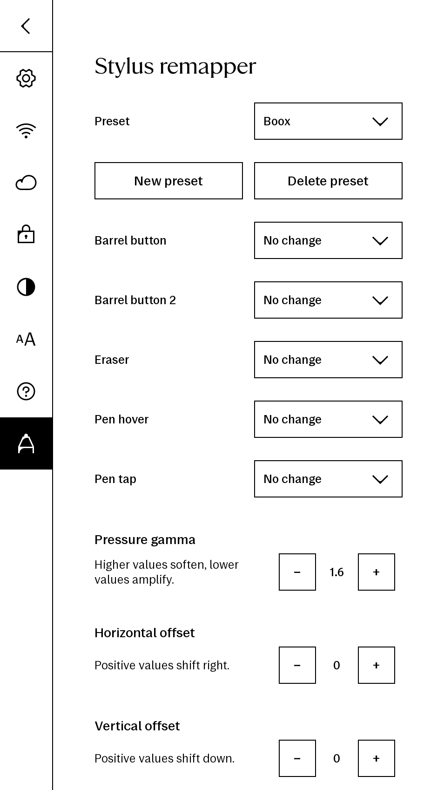

# stylus-remapper
[](https://remarkable.com/store/remarkable)
[](https://remarkable.com/store/remarkable-2)
[](https://remarkable.com/store/overview/remarkable-paper-pro)
[](https://remarkable.com/products/remarkable-paper/pro-move)
[](https://remarkable.com/products/remarkable-paper/pure)

<p align="justify">

Remaps stylus input events on reMarkable tablets. Grabs the real pen input device, creates a virtual clone via uinput, and bind mounts it over the original so all consumers see remapped events transparently.

### Installation via [Vellum package manager](https://github.com/vellum-dev/vellum)

```
vellum add stylus-remapper
```

### Manual installation

Download the correct binary for your device from the [latest release](https://github.com/rmitchellscott/rm-stylus-remapper/releases/latest) and copy to `~/.vellum/bin/stylus-remapper` on the tablet.

### Settings UI (optional)

Download `stylusRemapperSettings.qmd` from the [latest release](https://github.com/rmitchellscott/rm-stylus-remapper/releases/latest) and copy to `~/xovi/exthome/qt-resource-rebuilder/` on the tablet. Requires [xovi](https://github.com/asivery/xovi) with the `qt-resource-rebuilder` extension. Adds a "Stylus" page to xochitl's settings with preset management, button remapping, pressure gamma, and position offset controls.



### xovi scripts

Create xovi pre-start and pre-stock scripts:

```bash
# ~/xovi/scripts/pre-start/stylus-remapper.sh
#!/bin/bash
killall stylus-remapper 2>/dev/null
/home/root/.vellum/bin/stylus-remapper &

# ~/xovi/scripts/pre-stock/stylus-remapper.sh
#!/bin/bash
killall stylus-remapper 2>/dev/null
```

### Usage

```bash
stylus-remapper [--map FROM=TO ...] [--pressure-gamma VALUE] [--offset-x N] [--offset-y N] [-d /dev/input/eventN]
```

The pen device is auto-detected if `--device`/`-d` is not specified. CLI flags override config file values.

### Config file

Settings can be stored in a JSON config file at `/home/root/.config/stylus-remapper.conf` (override with `--config`). The config file is watched for changes — edits take effect immediately without restarting.

Simple format (all fields optional):

```json
{
  "pressure-gamma": 1.5,
  "offset-x": 100,
  "offset-y": -50,
  "mappings": ["TOOL_RUBBER=STYLUS"]
}
```

Named presets:

```json
{
  "active": "inksense",
  "presets": {
    "inksense": {
      "pressure-gamma": 1.5,
      "mappings": ["TOOL_RUBBER=STYLUS"]
    },
    "remarkable": {
      "pressure-gamma": 0.65,
      "mappings": ["TOOL_RUBBER=STYLUS"]
    }
  }
}
```

CLI flags take precedence over config file values at startup. With no config file or an empty file, the remapper runs in passthrough mode.

### Pressure curve

`--pressure-gamma` applies a power curve to pressure values. Values greater than 1 soften pressure (require more force for the same line weight), values less than 1 amplify it. Default is 1.0 (passthrough).

| Gamma | Effect |
|-------|--------|
| 1.5 | Softer, lighter strokes |
| 0.65 | More sensitive, darker strokes |

### Position offset

`--offset-x` and `--offset-y` shift the pen position by a fixed number of device units. Positive X shifts right, positive Y shifts down. Values are clamped to the device's axis range.

### Available key names

| Name | Code |
|------|------|
| BTN_TOOL_PEN | 0x140 |
| BTN_TOOL_RUBBER | 0x141 |
| BTN_TOUCH | 0x14a |
| BTN_STYLUS | 0x14b |
| BTN_STYLUS2 | 0x14c |

Short forms without the `BTN_` prefix also work (e.g. `TOOL_RUBBER`, `STYLUS`).

### Examples

```bash
# Eraser end acts as barrel button
stylus-remapper --map TOOL_RUBBER=STYLUS

# Barrel button activates eraser
stylus-remapper --map STYLUS=TOOL_RUBBER

# Multiple mappings
stylus-remapper --map TOOL_RUBBER=STYLUS --map STYLUS2=STYLUS

# Soften pressure curve
stylus-remapper --pressure-gamma 1.5

# Combine button remap with pressure curve
stylus-remapper --map TOOL_RUBBER=STYLUS --pressure-gamma 1.5

# Shift pen position
stylus-remapper --offset-x 100 --offset-y -50
```

### How it works

1. Auto-detects the pen input device via `/proc/bus/input/devices`
2. Opens the real device via a temporary char device node (survives bind mounts)
3. Creates a uinput virtual device with identical capabilities
4. Grabs the real device exclusively
5. Bind mounts the virtual device over the original path
6. Forwards all events, remapping configured key codes and applying pressure/offset transforms
7. Watches config file for changes and applies updates live
8. On SIGTERM/SIGINT: lazy unmounts, releases grab, destroys virtual device

Designed to run as a [xovi](https://github.com/asivery/xovi) pre-start script before xochitl launches.

## License
Copyright (C) 2026 Mitchell Scott

Licensed under the GNU General Public License v3.0.
